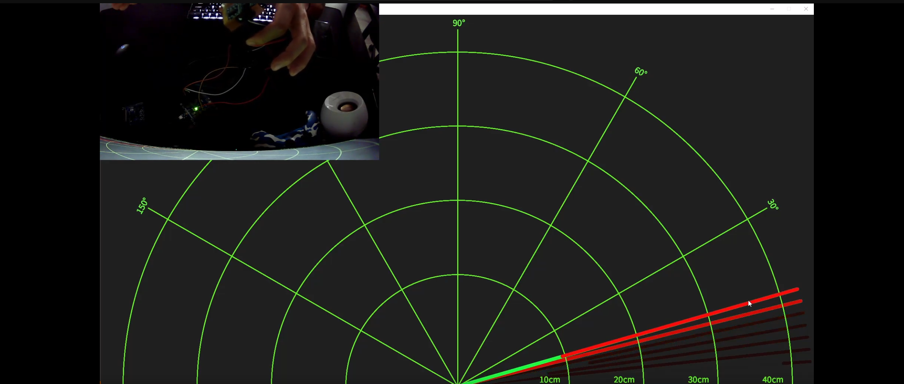

# Mock Radar Using an HC-SR04 and a Servo

# What is the idea?

This project uses an ultrasonic distance sensor, an HC-SR04, which uses the time taken to send then recieve a signal
to calculate the distance from an object. A servo is used to rotate this sensor, mimicing the rotation of an industry radar.

# Explanation of code

In short, the ultrasonic sensor works in the following steps:
1. Send a trigger to the sensor to have it send a signal out.
2. If there is an object, it will receive this signal in its receiver.
3. An echo pulse is then sent out, in which the length of this pulse dictates the time it took.
4. Using some math, the actual distance can be calculated.

For the firmware, a timer is used to count the duration of the echo pulse. Once this series of events finishes, this equation is carried out 
```C
distance = (double)count / (58*16);    //calculate the distance from the result of the caluclation
```
Where 58 is derived from the speed of sound in cm/us, factoring in the 2 trips a signal takes, as well as the conversion from microseconds to timer ticks. 


Count is calculated using the Overflow counter, which determines how many times the timer has reached its max value, as well as the input capture register, which holds the value of the timer when the echo pulse finishes. 

Dividing these two results in a distance of centimeters. 

While this is going on, the sensor is constantly rotating, when it reaches its max angle it resets back to zero. This is done by adjusting the PWM output by modifying the OCR3A register. 

# Result


Using an Arduino sketch, the serial output of the distance is displayed through this GUI. 